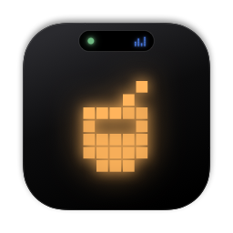
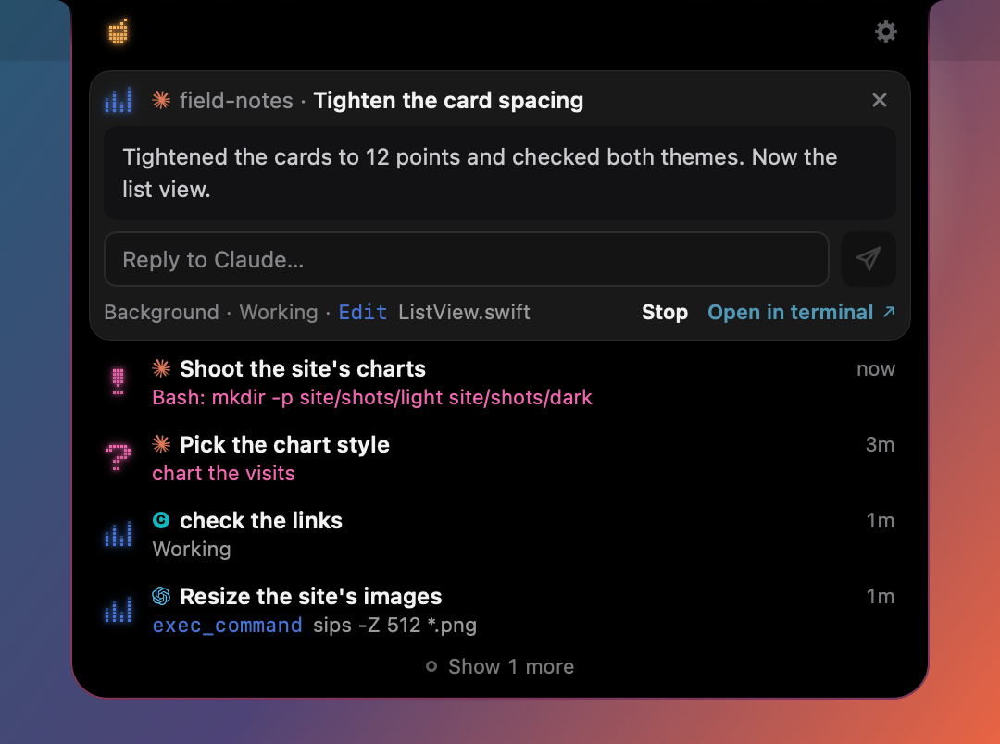

<p align="center">
  
</p>

<h1 align="center">Juice</h1>

<p align="center">
  <b>Your coding agents, in the notch.</b><br>
  See every session, answer prompts and check your limits, without switching windows.
</p>

<p align="center">
  <picture>
    <source media="(prefers-reduced-motion: reduce)" srcset="https://raw.githubusercontent.com/michaelofengenden/juiceisland/main/docs/images/readme-demo-poster.png">
    
  </picture>
</p>

<p align="center">
  <a href="https://github.com/michaelofengenden/juiceisland/releases/latest/download/Juice.dmg">
    <picture>
      <source media="(prefers-color-scheme: dark)" srcset="https://raw.githubusercontent.com/michaelofengenden/juiceisland/main/docs/images/readme-download-dark.png">
      
    </picture>
  </a>
</p>

<p align="center">
  or with Homebrew: <code>brew install --cask michaelofengenden/tap/juiceisland</code><br>
  <sub>Free and open source · macOS 26 or later · Apple silicon and Intel</sub>
</p>

## What it does

### Answer from the notch

When an agent marked Approve asks to run a command or asks you a question, the island opens with its card. Click Yes or No, or pick an answer, and the agent carries on.

<p align="center"></p>

### Every session, one glance

The closed island counts your sessions and shows when one needs you. Open it to see what each one is doing, and jump back to its terminal tab with a click.

<p align="center"></p>

### Your limits, as batteries

One battery per Claude and Codex account, with the time it resets. Add a key for any of 13 providers, such as OpenRouter or Anthropic, and Juice shows your balance or spend beside them. The Usage widget keeps it all on your desktop.

<p align="center"></p>

### Sessions that keep running

Send a session to the island and its card stays in the notch with the last answer: reply to Claude Code or Codex right there. Claude Code goes on in its own background, even after you close the window.

<p align="center"></p>

## Works with

Claude Code, Codex and 16 more. Connect the ones on your Mac with one click.

<!-- agent-grid: written by ReadmeAgentGridTests from the agents table; JI_WRITE_AGENT_GRID=1 swift test --filter ReadmeAgentGridTests rewrites it -->

| Approve: answer from the island | Watch: see it and jump back |
|---|---|
| Claude Code | Cursor |
| Codex¹ | Gemini CLI |
| OpenCode | Antigravity |
| Copilot CLI | Grok Build |
| Qwen Code | Factory Droid |
| Devin | Kimi Code |
| Kilo | Pi |
| Qoder² | Oh My Pi |
| CodeBuddy | Amp |

¹ With Settings › Island › Answer Codex in Juice; Watch otherwise.

² Qoder CLI; the Qoder IDE is Watch.

<!-- /agent-grid -->

## Get started in a minute

1. **Download** [Juice.dmg](https://github.com/michaelofengenden/juiceisland/releases/latest/download/Juice.dmg).
2. **Open it** and drag Juice to Applications.
3. **Open Juice and click Connect.** It lists the agents it finds on your Mac and adds its hooks to the ones you tick, after a backup of each file. Nothing changes before that click.

With Homebrew, one line does the first two steps:

```sh
brew install --cask michaelofengenden/tap/juiceisland
```

<p align="center"></p>

## Private by design

- **Free and open source.** GPL-3.0, with no account, no paid tier and no licence key.
- **No analytics.** No server, no crash reporter and no usage tracking.
- **Never reads your logins.** Usage comes from the `claude` and `codex` tools' own usage requests. Juice never opens their login files or the Keychain.
- **Changes files only when you click, with backups.** Remove gives each file back as it was.

[What Juice reads and changes](docs/PRIVACY.md), in full.

## Questions

<details>
<summary><b>Is it free?</b></summary>

Yes. Juice is free and open source under the GPL-3.0, with no paid tier, no account and no licence key.

</details>

<details>
<summary><b>Which Macs does it run on?</b></summary>

Any Mac with macOS 26 or later, Apple silicon or Intel. On a screen without a notch the island hangs from the top centre, and Juice can also run as a window.

</details>

<details>
<summary><b>Which agents does it work with?</b></summary>

The 18 agents under [Works with](#works-with). You answer the ones marked Approve from the island. The ones marked Watch show their sessions there, and you answer them in their own window.

</details>

<details>
<summary><b>Does it send anything anywhere?</b></summary>

Juice has no server and no analytics. It goes online only for updates from GitHub (a check once a day), for money from the providers you add a key for, and over `ssh` to hosts you set up. Its batteries come from the `claude` and `codex` tools on your Mac, which ask their own servers as they do whenever you use them. [What Juice reads and changes](docs/PRIVACY.md) has the details.

</details>

<details>
<summary><b>How do I uninstall it?</b></summary>

In Settings › Agents, click Remove from all agents first, so no agent calls a helper that is gone. Then move Juice to the Trash, or run `brew uninstall --zap --cask juiceisland`.

</details>

## Build from source

You need macOS 26 or later, Xcode 27, [XcodeGen](https://github.com/yonaskolb/XcodeGen), git and zsh.

```sh
git clone https://github.com/michaelofengenden/juiceisland.git
cd juiceisland
zsh scripts/build-app.sh --public
```

The last line it prints is the built app. A copy you build has updates off, and without a signing identity its widget stays empty. [CONTRIBUTING.md](CONTRIBUTING.md) says how to sign it with your own team and how to run the tests.

## Reporting a problem

[Open an issue](https://github.com/michaelofengenden/juiceisland/issues/new/choose). Settings › Diagnostics › Report a Bug fills in the form with your agent, terminal and macOS, and a report of states, times and counts with no email, key or session text; nothing is sent until you send it on GitHub. For a security problem, see [SECURITY.md](SECURITY.md).

## Licence

Juice is free software under the GNU General Public License, version 3 ([LICENSE](LICENSE)). Its session engine comes from [Open Island](https://github.com/Octane0411/open-vibe-island), also GPL-3.0; [NOTICE](NOTICE) says what was taken and what was changed.

<sub>Juice is not affiliated with Anthropic, OpenAI, GitHub, Anysphere, Alibaba, Cognition, Kilo Code, Google, xAI, Tencent, Factory, Moonshot AI or the makers of OpenCode, Pi, Oh My Pi or Amp. Claude, Claude Code, ChatGPT, Codex, Copilot, Cursor, Qwen, Devin, Kilo, Gemini, Antigravity, Grok, Qoder, CodeBuddy, Droid, Kimi and Amp are trademarks of their owners, named here only to say which accounts and sessions Juice shows.</sub>
