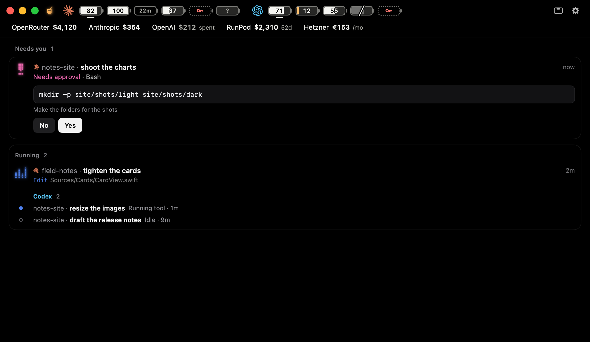
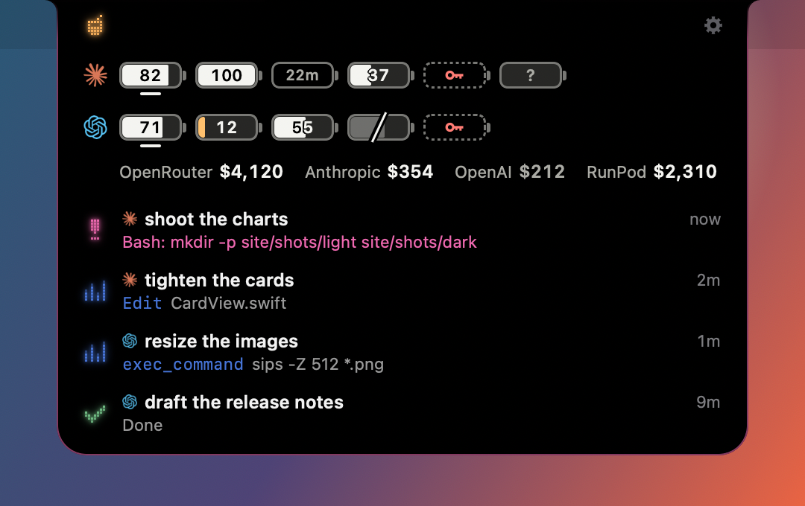
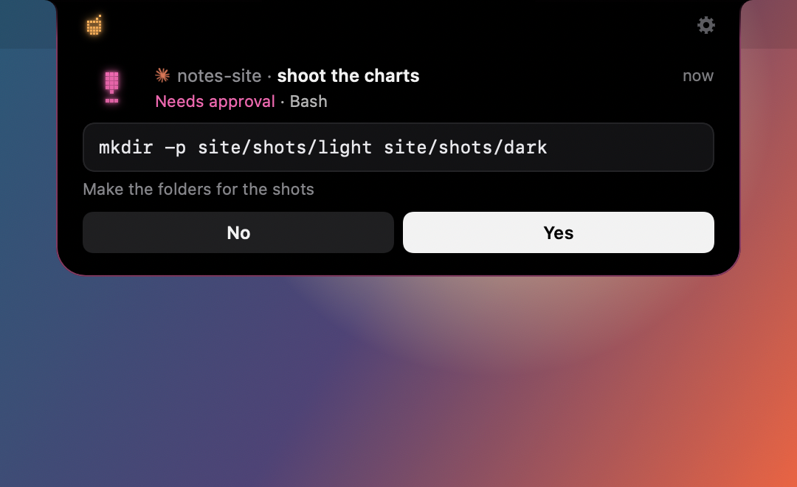
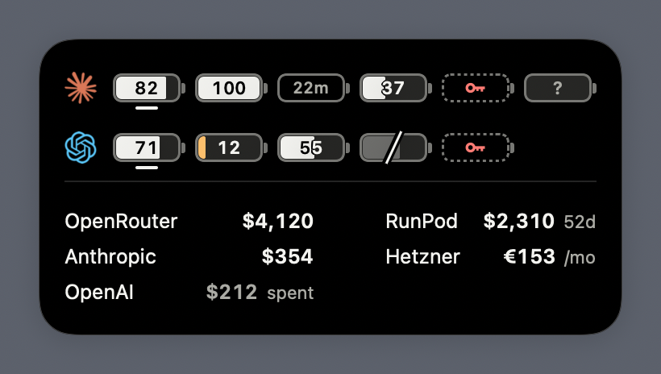

# Juice

Juice is a small macOS app for people who run Claude Code and Codex. It shows how much of each account's limit is left, and what every agent session is doing: which one needs you, which one is running, which one is done. It lives in a window, or in the notch as a small black island.



- **Usage.** One battery per Claude and Codex account you are signed in to, with the time it resets. Optional money: OpenRouter, Anthropic, OpenAI, RunPod and Hetzner, from keys you add.
- **Sessions.** Every Claude Code and Codex session in one list. Approve a command or answer a question from the island, or jump to the session's own terminal tab.
- **Desktop panel and widget.** The batteries on your desktop, if you want them there.

<p>
  
  
</p>
<p></p>

## Download

Get `Juice-<version>.dmg` from the [latest release](https://github.com/michaelofengenden/juice-app/releases/latest). It is signed and notarized. Open it, drag Juice to Applications, and open it from there. Juice checks the same page for updates once a day, and installs one only when you click.

Juice needs macOS 26 or later, on Apple silicon or Intel. It is tested on macOS 27.

Then open Settings › Setup and click Install for Claude Code and Codex, so their sessions show up.

## What it reads

Everything stays on your Mac. Juice has no server, no account and no analytics.

- **Usage** comes from the `claude` and `codex` tools you already have, through their own usage requests. Juice never reads, stores or sends their login tokens, and never sends a prompt. It asks at most every 2 to 5 minutes per Claude account, and every 15 to 60 seconds per Codex account, the faster pace only near the account's limit. These are the tools' own interfaces and not all of them are documented, so an update of `claude` or `codex` can break a battery until Juice catches up. While Juice reads a Codex account, Codex also fetches its model list every few minutes, as it does whenever it runs.
- **Sessions** come from the hook events Claude Code and Codex send to Juice over a socket on your Mac, and from their session files in `~/.claude` and `~/.codex` (and in `~/.claude-*` and `~/.codex-*` profile folders).
- **Money**, only for the providers you add a key for. Keys are plain files readable only by you (mode 600) under `~/.config/<provider>/`, not in the Keychain. Use a read-only key where the provider offers one.
- **Network.** Juice talks to the network only for money (each provider's own API, with your key), to check GitHub for an update, and, for SSH hosts you set up, over `ssh`.

## What it changes, and only when you click

- **Hooks.** Settings › Setup › Install adds Juice's hooks to Claude Code's `settings.json` and Codex's config in each profile folder. Remove takes them out. A file Juice will not change is left exactly as it was, and the last three backups of each changed file are kept beside it.
- **Approvals.** While Juice runs, Claude Code and Codex wait for your answer in the island when they ask for permission. Always allow adds the rule Claude suggests to its settings.
- **Open Island.** Juice uses Open Island's hook helper and socket, so the two cannot run together. Quit Open Island first: Juice does not start listening while Open Island runs, and Install takes over the hooks Open Island set up.
- **SSH hosts.** Off unless you set one up. Setting up a host copies a small Python helper into your home folder on that host and adds hooks to its Claude Code and Codex settings. With Live sessions on, Juice keeps one `ssh` connection open per host. It reads only the Host names in `~/.ssh/config` and never asks for a password.
- **Open in and Reply** type into your terminal through AppleScript, so macOS asks for Automation permission the first time. Open in starts `claude` or `codex` in a new terminal window; Reply sends text only to the session's own terminal.

## Build from source

You need macOS 26 or later, Xcode 27, [XcodeGen](https://github.com/yonaskolb/XcodeGen) (`brew install xcodegen`), git and zsh. For batteries, Claude Code or Codex installed and signed in.

```sh
git clone https://github.com/michaelofengenden/juice-app.git
cd juice-app
zsh scripts/build-app.sh --public
```

The last line it prints is the built app, made for your Mac's own chip (`--public --universal` makes one for Apple silicon and Intel). Copy it to Applications and open it. Without a signing identity the app is signed ad hoc: it runs, but macOS asks for Automation permission again after every rebuild, and the widget stays empty. A copy you build has updates off unless you give it a Sparkle key of your own. [CONTRIBUTING.md](CONTRIBUTING.md) says how to sign with your own team, and how to run the tests.

## Licence

Juice is free software under the GNU General Public License, version 3 ([LICENSE](LICENSE)). Its session engine comes from [Open Island](https://github.com/Octane0411/open-vibe-island), also GPL-3.0; [NOTICE](NOTICE) says what was taken and what was changed.

Juice is not affiliated with Anthropic or OpenAI. Claude, Claude Code, ChatGPT and Codex are trademarks of their owners, named here only to say which accounts and sessions Juice shows.
