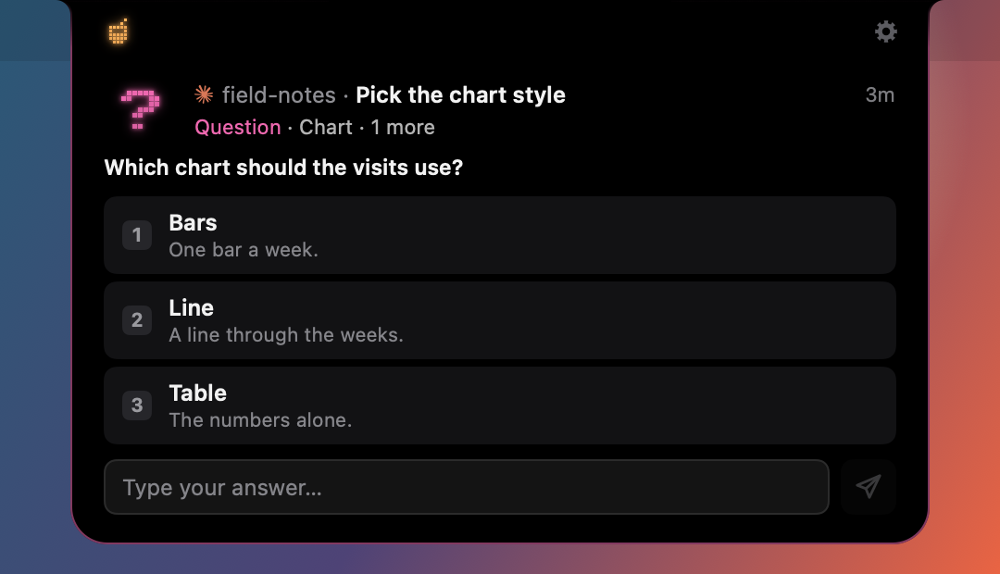
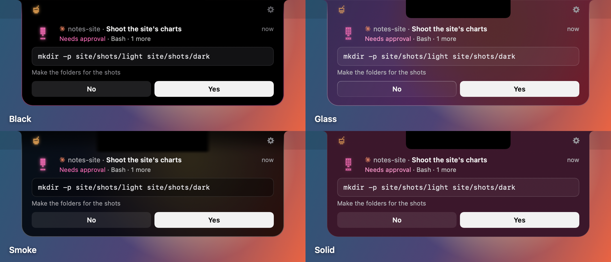
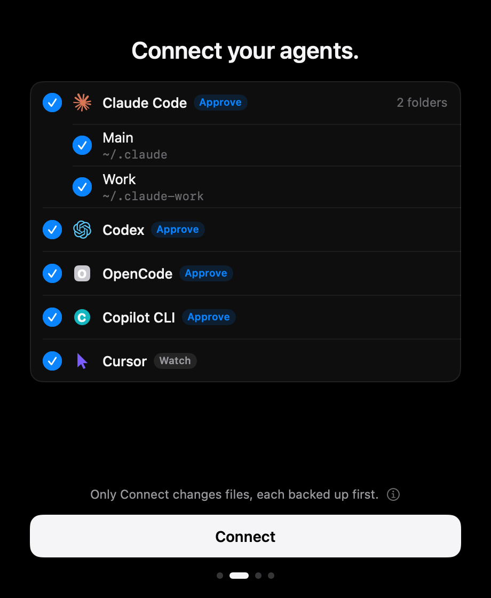
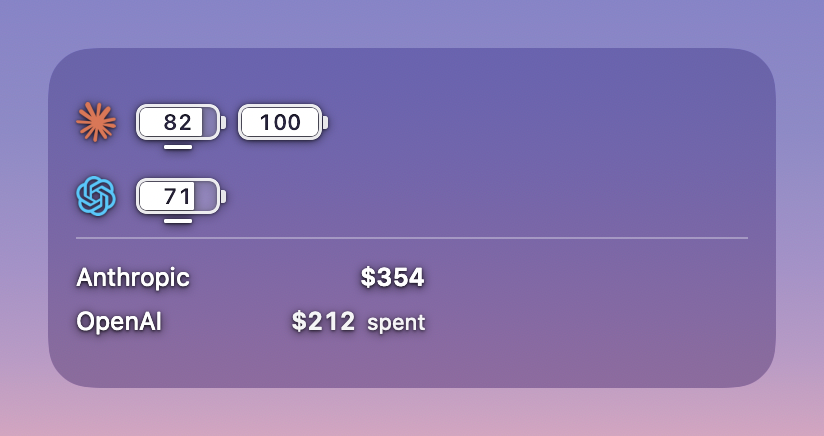

# Juice

Juice is a small island in your Mac's notch for Claude Code, Codex, Copilot CLI, Cursor, OpenCode, Qwen Code, Devin, Kilo, Gemini CLI, Antigravity, Grok Build, Qoder, CodeBuddy, Factory Droid, Kimi Code, Pi, Oh My Pi and Amp: see what each session is doing and jump back to its tab, answer prompts from the agents marked Approve below, and see how much of each account's limit is left.

[](https://github.com/michaelofengenden/juiceisland/releases/latest/download/Juice.dmg)
[](#install)
[](#install)
[](LICENSE)
[](#what-it-reads)

```sh
brew install --cask michaelofengenden/tap/juiceisland
```

Or download [Juice.dmg](https://github.com/michaelofengenden/juiceisland/releases/latest/download/Juice.dmg), open it and drag Juice to Applications.

<p align="center"></p>

## Install

Open Juice and click Connect.

The first time it opens, Juice lists the agents it finds on your Mac. Connect adds its hooks to the ones you tick, after a backup of each file it changes, and nothing is written before that click. Juice needs macOS 26 or later, on Apple silicon or Intel. It is signed and notarized, and it checks GitHub for an update once a day, installing one only when you click, or when you quit if you turn on Settings › About › Install automatically.

## Agents

<!-- agent-grid: written by ReadmeAgentGridTests from the agents table; JI_WRITE_AGENT_GRID=1 swift test --filter ReadmeAgentGridTests rewrites it -->

| Agent | From the island | Usage | Juice's hooks go in |
|---|---|---|---|
| Claude Code | Approve | Battery per account | `settings.json` in `~/.claude` and each `~/.claude-*` profile |
| Codex | Approve¹ | Battery per account | `hooks.json` and `config.toml` in `~/.codex` and each `~/.codex-*` profile |
| OpenCode | Approve |  | `~/.config/opencode/plugins/juice.js` |
| Copilot CLI | Approve |  | `~/.copilot/hooks/juice.json` |
| Cursor | Watch |  | `~/.cursor/hooks.json` |
| Qwen Code | Approve |  | `~/.qwen/settings.json` |
| Devin | Approve |  | `~/.config/devin/config.json` |
| Kilo | Approve |  | `~/.config/kilo/plugin/juice.js` |
| Gemini CLI | Watch |  | `~/.gemini/settings.json` |
| Antigravity | Watch |  | `~/.gemini/config/hooks.json` |
| Grok Build | Watch |  | `~/.grok/hooks/juice.json` |
| Qoder | Approve² |  | `~/.qoder/settings.json` |
| CodeBuddy | Approve |  | `~/.codebuddy/settings.json` |
| Factory Droid | Watch |  | `~/.factory/hooks.json` or `~/.factory/hooks/hooks.json` or `~/.factory/settings.json` |
| Kimi Code | Watch |  | `~/.kimi-code/config.toml` or `~/.kimi/config.toml` |
| Pi | Watch |  | `~/.pi/agent/extensions/juice.ts` |
| Oh My Pi | Watch |  | `~/.omp/agent/extensions/juice.ts` |
| Amp | Watch |  | `~/.config/amp/plugins/juice.ts` |

**Approve**: answer its prompts from the island. **Watch**: see its sessions and jump to them, and answer its prompts there.

¹ With Settings › Island › Answer Codex in Juice; Watch otherwise.

² Qoder CLI; the Qoder IDE is Watch.

<!-- /agent-grid -->

## How Juice is different

- **Free and open source.** GPL-3.0, with no paid tier and no licence key.
- **No analytics.** No account, no server, no crash reporter and no usage tracking.
- **Never reads your logins.** Usage comes from the `claude` and `codex` tools' own usage requests. Juice never opens their login files or the Keychain, and never sends a prompt of its own: it sends only what you type.
- **Never touches your status line.** Your agents' own status lines stay as you set them.
- **Changes files only when you click, with backups.** Hooks go in on Connect and come out on Remove, and a file Juice will not edit gets the exact lines to paste instead.

## A closer look

<p align="center"></p>
<p>
  
  
</p>
<p></p>
<p align="center"></p>
<p>
  
  
</p>
<p></p>

- **Sessions.** Every session of every connected agent in one list. Approve a command or answer a question from the island, or jump to the session's own terminal tab.
- **Usage.** One battery per Claude and Codex account you are signed in to, with the time it resets. Optional money from 13 providers (OpenRouter, Anthropic, OpenAI, DeepSeek, xAI, RunPod, Hetzner and more), from keys you add.
- **Your look.** Black, Glass, Smoke or Solid, light or dark, as a window or in the notch.
- **Desktop panel and widget.** The batteries on your desktop, if you want them there.

## What it reads

Everything stays on your Mac. Juice has no server, no account and no analytics.

- **Usage** comes from the `claude` and `codex` tools you already have, through their own usage requests. Juice never reads, stores or sends their login tokens, and a usage read never sends a prompt. Juice sends only what you type: a reply from a session's card goes to that session, typed into its tab, or, once the tab is closed, through Claude Code's or Codex's own resume, when you press Return. It asks at most every 2 to 5 minutes per Claude account, and every 15 to 60 seconds per Codex account, the faster pace only near the account's limit. These are the tools' own interfaces and not all of them are documented, so an update of `claude` or `codex` can break a battery until Juice catches up. While Juice reads a Codex account, Codex also fetches its model list every few minutes, as it does whenever it runs.
- **Sessions** come from the hook events each connected agent sends to Juice over a socket on your Mac, and from Claude Code's and Codex's session files in `~/.claude` and `~/.codex` (and in `~/.claude-*` and `~/.codex-*` profile folders).
- **Money**, only for the providers you add a key for. Keys are plain files readable only by you (mode 600) under `~/.config/<provider>/`, not in the Keychain. Use a read-only key where the provider offers one.
- **Network.** Juice talks to the network only for money (each provider's own API, with your key), to check GitHub for an update, and, for SSH hosts you set up, over `ssh`.

## What it changes, and only when you click

- **Hooks.** Connect copies Juice's hook helper to `JuiceHooks` in Juice's own folder in `~/Library/Application Support`, and adds Juice's hooks to each agent you tick, in the files the table above names. Settings › Agents connects or removes one agent at a time. Remove takes Juice's lines out and gives each file back as it was, and a file only Juice wrote goes; Remove from all agents does this everywhere. A file that is a link, a JSON file with comments, or a TOML file Juice can't add to without touching your lines is never changed: its row gives the lines to paste by hand (Copy snippet). The last three backups of each changed file are kept beside it.
- **Approvals.** While Juice runs, an agent marked Approve waits for your answer in the island when it asks for permission. Copilot CLI, CodeBuddy, Devin and Qwen Code show no prompt of their own while they wait, so their approvals always open the island and sound, even for a session you muted or are looking at. Always allow adds the rule Claude Code suggests to its settings.
- **Other apps' hooks.** Juice has its own hook helper and socket, so it runs beside Open Island, whose hooks and plugin stay as they are. When another notch app's hooks are in an agent's files, the first run shows a card and leaves those agents alone until you pick. Switch asks that app to quit, backs up each of those files beside it, takes out only the lines that call that app's helper (and its OpenCode plugin file), then connects Juice. Keep leaves them with that app. It may put its hooks back when it opens again, so use its own uninstall to remove it fully.
- **SSH hosts.** Off unless you set one up. Setting up a host copies a small Python helper into your home folder on that host and adds hooks to its Claude Code and Codex settings. With Live sessions on, Juice keeps one `ssh` connection open per host. It reads only the Host names in `~/.ssh/config` and never asks for a password.
- **Sounds.** Choose File… in Settings › Sound copies the file you pick into a Sounds folder in Juice's own folder in `~/Library/Application Support`. The file you picked stays where it is.
- **Open in and Reply** type into your terminal through AppleScript, so macOS asks for Automation permission the first time. Open in starts `claude` or `codex` in a new terminal window; Reply sends text only to the session's own terminal.

To uninstall, click Remove from all agents in Settings › Agents first, so no agent calls a helper that is gone. Then move Juice to the Trash, or run `brew uninstall --zap --cask juiceisland`.

## Build from source

You need macOS 26 or later, Xcode 27, [XcodeGen](https://github.com/yonaskolb/XcodeGen) (`brew install xcodegen`), git and zsh. For batteries, Claude Code or Codex installed and signed in.

```sh
git clone https://github.com/michaelofengenden/juiceisland.git
cd juiceisland
zsh scripts/build-app.sh --public
```

The last line it prints is the built app, made for your Mac's own chip (`--public --universal` makes one for Apple silicon and Intel). Copy it to Applications and open it. Without a signing identity the app is signed ad hoc: it runs, but macOS asks for Automation permission again after every rebuild, and the widget stays empty. A copy you build has updates off unless you give it a Sparkle key of your own. [CONTRIBUTING.md](CONTRIBUTING.md) says how to sign with your own team, and how to run the tests.

## Reporting a problem

[Open an issue](https://github.com/michaelofengenden/juiceisland/issues/new/choose). The bug form asks for the agent, the terminal and your macOS version, and for the text of Settings › Diagnostics › Copy Report: states, times and counts, with no email, key or session text. Read it before you paste it. Settings › Diagnostics › Report a Bug opens the same form with those filled in; nothing is sent until you send it there. For a security problem, see [SECURITY.md](SECURITY.md).

## Licence

Juice is free software under the GNU General Public License, version 3 ([LICENSE](LICENSE)). Its session engine comes from [Open Island](https://github.com/Octane0411/open-vibe-island), also GPL-3.0; [NOTICE](NOTICE) says what was taken and what was changed.

Juice is not affiliated with Anthropic, OpenAI, GitHub, Anysphere, Alibaba, Cognition, Kilo Code, Google, xAI, Tencent, Factory, Moonshot AI or the makers of OpenCode, Pi, Oh My Pi or Amp. Claude, Claude Code, ChatGPT, Codex, Copilot, Cursor, Qwen, Devin, Kilo, Gemini, Antigravity, Grok, Qoder, CodeBuddy, Droid, Kimi and Amp are trademarks of their owners, named here only to say which accounts and sessions Juice shows.
